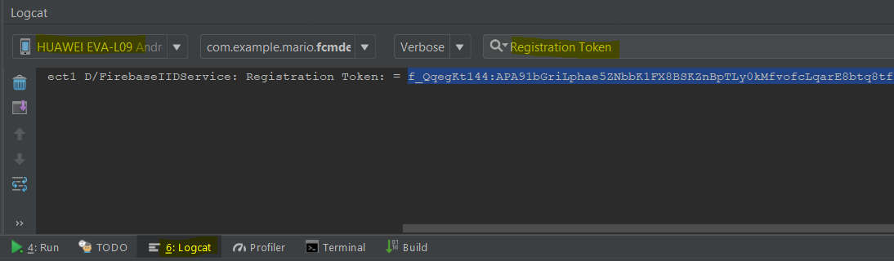
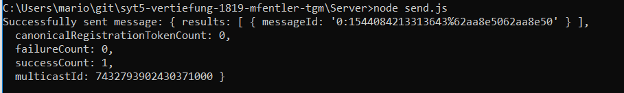
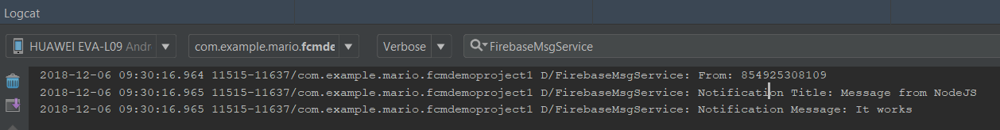
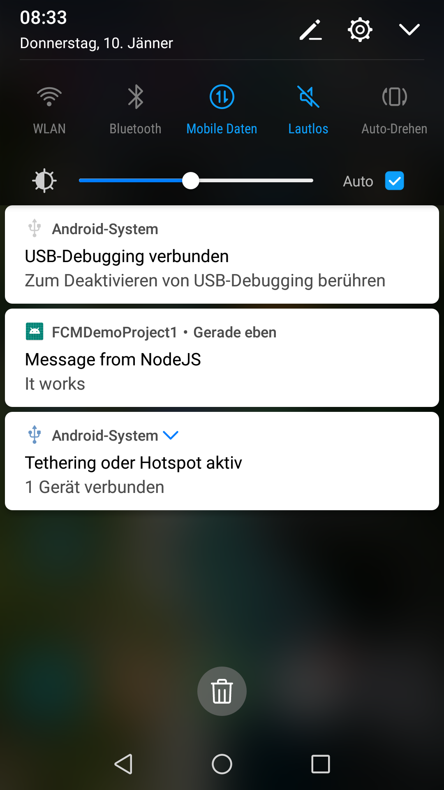

# _IOT-Smartphone Einbindung_
[Link zum Overleaf Protokoll](https://v2.overleaf.com/project/5bb5baccd912b3352d0abc3c)  


## Einleitung
In diesem Thema geht es darum, Nachrichten, die von einem Embeded-System an einen Server geschickt werden aufzubereiten und an ein Smartphone weiterzuleiten. Beispielsweise erkennt ein Raspberry-Pi über einen Sensor eine Bewegung und schickt somit ein Signal an einen Server. Dieser empfängt dieses und schickt dem Benutzer eine Notification auf sein Smartphone.  
Der grundlegende Teil mit der Sensorerkennung und Übertragung des Signals wird in einer Theorieeinheit im Systemtechnikunterricht geleehrt. Auf den weiteren Teil wird in dieser Vertiefung eingegangen.

## Ziele
Ziel ist es, bei einem Sensorinput am Embeded-Device eine Nachricht an einen Server zu schicken. Dieser empfängt die Nachricht, und sendet dann eine Notifizierung an das Smartphone.  
Weiterführend könnte man dann auch eine Steuerung des Devices via Smartphone in Betracht ziehen.  

Die Recherche zur Realisierung des Projekts ist auch ein Teil dieser Vertiefung.

## Projektvoraussetzungen

[Android Studio](https://developer.android.com/studio/)

## Recherche
Um den Message Transfer vom Server zu Smartphone zu realisieren, kann FCM (Firebase Cloud Messaging), früher Google Cloud Messaging (veraltet), verwendet werden.

### Alternativen
Firebase ist die am weitesten verbreitete und ausgereifste Solution. Allerdings gibt es auch Alternativen dazu, die man auch eventuell nehmen könnte.  
[Alternatives](https://blog.back4app.com/2018/01/12/firebase-alternatives/).  
Man könnte es auch mit Plain JavaScript nachbauen. Das wäre genauso kostenlos, würde aber mehr Zeit in Anspruch nehmen.  

## SetUp FCM
Dies kann man entweder automatisch von Android Studio machen lassen (Tools/Firebase/Cloud Messaging) oder manuell machen.  
Da ich Probleme mit der automatischen Erstellung hatte wird hier nun der manuelle Weg beschrieben.  

#### Step 1 - Firebase App Registrierung
In der Firebase Console [2], wählt man "Add new Project". Anschließend wird man nach einem Projektnamen gefragt. Diesen kann man frei wählen.  
Als nächstes muss man den Android Paketnamen eingeben. Diesen findet man in der "app/build.gradle" Datei im Android Projekt.  

Nun kann man das "google-services.json" File herunterladen, welches man im "app" Ordner des Android Projekts platziert.

#### Step 2 - Editing gradle
Im "build.gradle" File in den Dependencies folgende Line einfügen:

    classpath 'com.google.gms:google-services:4.1.0'
Im "app/build.gradle" File in den Dependencies folgene Lines einfügen:

    implementation 'com.google.firebase:firebase-core:16.0.1'
    implementation 'com.google.firebase:firebase-messaging:17.3.3'
Als letztes im selben File ganz unten noch folgene Line einfügen, um das Gradle Plugin zu aktivieren:

    // ADD THIS AT THE BOTTOM
    apply plugin: 'com.google.gms.google-services'
Jetzt macht man noch einen Gradle-Sync und dann sollte es rennen.

## Nachrichten an das Smartphone senden
### Manuell
Manuell kann man Nachrichten aus der Firebase-Console an das Smartphone versenden. Dazu wählt man in der Firebase-Console "Firebase-CloudMessaging" aus, das gewünschte Projekt, verfasst eine Nachricht und wählt schlussendlich die Devices aus, die die Nachricht empfangen sollen.

### Nachrichten vom HTTP Server verschicken
Die Firebase-CloudMessaging Server senden Nachrichten an die Clients. Um selber die Nachrichten zu versenden, ohne dazu in die Firebase-Console gehen zu müssen, kann man über einen XMPP oder HTTP Server die Nachricht an die Firebase Server senden.  
Dazu muss man für den HTTP Server einen privaten Server-Key erstellen. Um das zu tun geht man in die Firebaseconsole, ins Projekt, klickt auf das Zahnrad um die Einstellungen aufzurufen, Dienstkonten, neuen privaten Schlüssel generieren.  

Dieses JSON File sollte man sicher abspeichern!

#### Registration Token
Für die weiteren Schritte in diesem Tutorial braucht man den Registration Token der App:  
https://www.techotopia.com/index.php/Sending_Firebase_Cloud_Messages_from_a_Node.js_Server  

Hier wird erklärt wie man diesen bekommt.  
https://www.techotopia.com/index.php/Firebase_Cloud_Messaging  

Die Methode onTokenRefresh() wird nur aufgerufen wenn die App neu installiert wird auf dem Device! Wenn man den Registration Token so erhalten will geht das so:  
https://stackoverflow.com/questions/37451395/firebase-ontokenrefresh-is-not-called

Um den Device Token vom Handy zu bekommen muss man Logcat erst am Telefon enablen. (siehe unten).
Danach geht man in Android Studio und öffnet das Logcat Window so wie hier:  
  

Der wird dort ausgegeben sobald man die App über Android Studio startet und sie dadurch auf dem Smartphone installiert wird. Danach bekommt man den Token im Logcat wie oben im Bild gezeigt.

#### Logcat am physical device
Damit der Log auch auf meinem Huawei P9 angezeigt wird muss man das erst enablen. Dazu muss man am Telefon eine bestimmte Nummer "anrufen".  -> __\*#\*#2846579#\*#\*__  
Die Schritte wie das funktioniert sind [hier](https://stackoverflow.com/questions/18124334/huawei-logcat-not-showing-the-log-for-my-app).

## Node.js Messages senden
Den vorher erhaltenen Registration Token fügt man nun manuell in das Script ein.
```node
//Huawei Device Reg Token, bekommen durch Installation der App
var registrationToken = "f_QqegKt144:APA91bGriLphae5ZNbbK1FX8BSKZnBpTLy0kMfvofcLqarE8btq8tf3xJZEAjrvIUWP0Spv30PD1pTSxnXe4mynplbMmphiwrXchXpt67vsTCKzhqWx9pePpbR7KDm15hNTarvEbJOUH"
```

[7], [6], [8]
Mit dem File send.js werden die Nachrichten gesendet. Dann bekommt man eine Response ob es gesendet wurde.  

  

Auf dem Device kann man eingehende Nachrichten loggen und den Output nach __FirebaseMsgService__ filtern und bekommt folgendes Ergebnis:  



Auch am Smartphone erhält man jetzt eine Message.  


### Messages an Activity weiterleiten
Damit man Methoden in der Main Activity erreichen kann, die dann den Text auf der GUI ändern, müssen diese über eine Instanz angesprochen werden. Activities erstellt man aber in einer anderen Klasse __NIE__ mit "new MainActivity()", da diese
Activities einen gewissen Lebenszyklus haben und man das so einfach nicht macht. Stattdessen holt man sich einfach nur eine Instanz davon [10]: 
```java
MainActivity.getInstance().updateMsgCounter("title", remoteMessage.getData().get("title"));
```
## Notification vs Data
Es gibt zwei verschiedene Arten Notfications zu verschicken. Einmal als "Notification" und einmal als "Data".  

Beim Ersten bekommt man die Nachrichten nur, wenn die App im Hintergrund ist. Da sie im Hintergrund von Google gemanaged wird. Sobald die App im Vordergrund ist, wird die Methode onMessageReceived aufgerufen. Da dort aber noch nicht viel steht wird auch nicht viel passieren.  

Bei der zweiten Art, werden die Notifications immer an die Methode __onMessageReceived()__ weitergeleitet. Egal ob die App im Vorder- oder im Hintergrund ist. Daher müssen wir uns selber darum kümmern, dass eine Push-Notification erstellt wird.  

Woraruf man beim Senden der Nachricht noch achten muss, ist dass man als Key "data" anstatt von "notification" verwendet.  

In der Java Funktion erstellt man die Notificiation dann selbst so:  
```java
/** Source: https://stackoverflow.com/a/38451582 */
Intent intent = new Intent(this, MainActivity.class);
intent.addFlags(Intent.FLAG_ACTIVITY_CLEAR_TOP);
PendingIntent pendingIntent = PendingIntent.getActivity(this, 0, intent, PendingIntent.FLAG_ONE_SHOT);
String channelId = "Default";
NotificationCompat.Builder builder = new  NotificationCompat.Builder(this, channelId)
        .setSmallIcon(R.mipmap.ic_launcher)
        .setContentTitle(remoteMessage.getData().get("title"))
        .setContentText(remoteMessage.getData().get("body"))
        .setAutoCancel(true)
        .setContentIntent(pendingIntent);
NotificationManager manager = (NotificationManager) getSystemService(NOTIFICATION_SERVICE);
if (Build.VERSION.SDK_INT >= Build.VERSION_CODES.O) {
    NotificationChannel channel = new NotificationChannel(channelId, "Default channel", NotificationManager.IMPORTANCE_DEFAULT);
    manager.createNotificationChannel(channel);
}
manager.notify(0, builder.build());
```
### Nachrichten in der App anzeigen
Damit die Nachrichten dann auch auf der GUI angezeigt werden, muss man auf die Methode in der MainActivity zugreifen (vorher erklärt). Als Parameter werden der ein Key/Value Paar übergeben. Die Methode setzt dann die Werte dementsprechend.
```java
MainActivity.getInstance().updateMsgCounter("title", remoteMessage.getData().get("title"));
MainActivity.getInstance().updateMsgCounter("body", remoteMessage.getData().get("body"));
MainActivity.getInstance().updateMsgCounter("counter", "increase");
```

Die Methode in der MainActivity wurde von mir erstellt. Sie setzt einfach Variablen, die nachher für die Anzeige verwendet werden.
```java
@Override
    public void updateMsgCounter(String key, String value){
        if(key.equals("title")){
            msgTitle = value;
        }else if(key.equals("body")){
            msgBody = value;
        }else if(key.equals("counter")){
            msgCounter = msgCounter + 1;
        }
    }
```

## Update der UI
Mit den Methoden __"onStart()"__ und __"onUpdate()"__, kann das Event des Öffnens der App abgefangen werden und die UI Elemente gesetzt werden.  
```java
@Override
protected void onStart(){
    super.onStart();

    ((TextView)findViewById(R.id.msgCounterText)).setText(msgCounter + "");
    if(msgTitle != null)
        ((TextView)findViewById(R.id.title)).setText(msgTitle + "");
    if(msgBody != null)
        ((TextView)findViewById(R.id.body)).setText(msgBody + "");

}

__UM NEUE SACHEN IN DER UI hinzuzufügen braucht man einen bestimmten Thread, siehe __
```

## Ergebnis
Wenn man nun die App sieht man den Titel und den Inhalt der letzten Notification. Das kann man natürlich beliebig ändern und somit alles mögliche mit Hilfe von Notifications and das Smartphone senden und anzeigen.

# Vertiefung Teil 2
## Ziel
Automatisches Registrieren des Devices mit seinem Reg-Token. Server von hardcoded Messagetransfer auf automatischen ändern.

## Implementierung
### Client

### Server
DB Referenz holen
```js
const admin = require("firebase-admin")

var serviceAccount = require("../key/fcmdemoproject1-firebase-adminsdk-rcdjv-5ddbab0bca.json")

admin.initializeApp({
  credential: admin.credential.cert(serviceAccount),
  databaseURL: "https://fcmdemoproject1.firebaseio.com"
})

var db = admin.firestore()
```
Registered Device Tokens aus der DB auslesen
```js
function getToken(){
	db.collection('regDevice').doc('regDocument').collection('allRegDevices').get()
		.then(snapshot => {
			snapshot.forEach(doc => {
			  allToken.push(doc.data().regToken)
			  console.log('pushed element: ' + doc.data().regToken)
			})
		})
		.catch(err => {
			console.log('Error getting documents', err)
		})
}
```
Delay definieren
```js
var delay = ( function() {
    var timer = 0;
    return function(callback, ms) {
        clearTimeout (timer)
        timer = setTimeout(callback, ms)
    }
})()
```
Nachricht an alle Devices schicken
```js
delay(function(){
	allToken.forEach(token => {		
		admin.messaging().sendToDevice(token, payload, options)
		  .then(function(response) {
			console.log("Successfully sent message")
			process.exit()
		  })
		  .catch(function(error) {
			console.log("Error sending message:", error)
			process.exit()
		  })
		
	0})
}, 10000 )
```

## Sources
[1] [https://firebase.google.com/docs/cloud-messaging/](https://firebase.google.com/docs/cloud-messaging/)  
[2] [https://console.firebase.google.com/u/0/](https://console.firebase.google.com/u/0/)  
[3] [https://medium.com/android-school/firebaseinstanceidservice-is-deprecated-50651f17a148](https://medium.com/android-school/firebaseinstanceidservice-is-deprecated-50651f17a148)  
[4] [https://medium.com/@srinuraop/sending-messages-from-app-server-to-clients-using-fcm-b2a471fc3e33](https://medium.com/@srinuraop/sending-messages-from-app-server-to-clients-using-fcm-b2a471fc3e33)  
[5] [http://www.zoftino.com/android-notification-data-messages-from-app-server-using-firebase-cloud-messaging#app-server-to-fcm-server](http://www.zoftino.com/android-notification-data-messages-from-app-server-using-firebase-cloud-messaging#app-server-to-fcm-server)  
[6] [https://www.techotopia.com/index.php/Sending_Firebase_Cloud_Messages_from_a_Node.js_Server](https://www.techotopia.com/index.php/Sending_Firebase_Cloud_Messages_from_a_Node.js_Server)
[7] [https://www.techotopia.com/index.php/Firebase_Cloud_Messaging](https://www.techotopia.com/index.php/Firebase_Cloud_Messaging)  
[8] [https://stackoverflow.com/questions/18124334/huawei-logcat-not-showing-the-log-for-my-app](https://stackoverflow.com/questions/18124334/huawei-logcat-not-showing-the-log-for-my-app)  
[9] [https://android.stackexchange.com/questions/69108/how-to-start-root-shell-with-android-studio](https://android.stackexchange.com/questions/69108/how-to-start-root-shell-with-android-studio)  
[10] [https://stackoverflow.com/questions/17315842/how-to-call-a-method-in-mainactivity-from-another-class](https://stackoverflow.com/questions/17315842/how-to-call-a-method-in-mainactivity-from-another-class)  